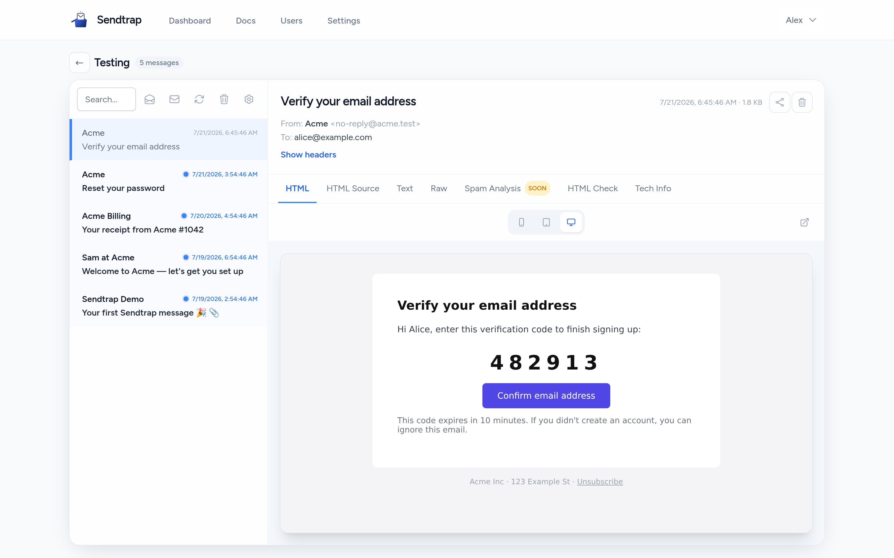
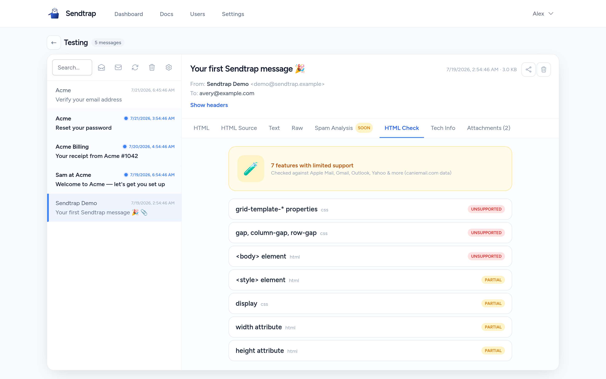
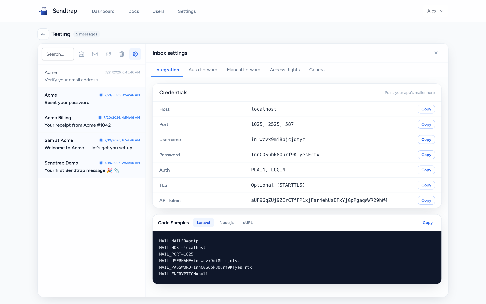

# Sendtrap Community

Sendtrap Community is a **self-hosted email sandbox**: point your
application's outgoing mail at it and every message is captured, parsed, and
browsable — nothing is ever delivered to a real mailbox. It runs as a single
workspace on your own machine or network, needs **no external account and no
internet access**, and is built on the MIT-licensed
[`sendtrap/core`](https://github.com/sendtraphq/sendtrap-core) package.



|  |  |
|:--:|:--:|
| Offline HTML compatibility checks | Per-inbox SMTP + API credentials |

## What you get

- **An SMTP server that catches instead of sends** — `php artisan
  mail:smtp-server` accepts SMTP (including STARTTLS) on port `1025` by
  default and files every message into an inbox.
- **Projects and inboxes** — organize captured mail per app/environment;
  each inbox has its own SMTP credentials and API token.
- **A message browser** — HTML/text/raw views, MIME structure, attachments,
  envelope and BCC capture, merge-tag detection.
- **Message checks** — deliverability lint checks and HTML client
  compatibility scored against the caniemail dataset, fully offline from a
  checked-in snapshot.
- **A bearer-token REST API per inbox** — list/filter messages, fetch
  detail/raw/HTML, download attachments, and assert on mail from your test
  suite ([see below](#built-for-test-suites)). Documented by an OpenAPI 3.1
  contract shipped with the app: browse it interactively at
  `/docs/api/reference` on your instance, or grab `/docs/api/openapi.yaml`
  (Postman collection alongside) to import into Postman, Bruno or Insomnia.
- **Public share links, webhooks and auto-forwarding** for individual
  messages.
- **A simple role model** — every user is an **owner** (manage users,
  settings, everything), **member** (manage projects/inboxes and mail), or
  **viewer** (read-only, no SMTP/API credentials visible).

## Built for test suites

Asserting on email in CI usually means a dance: poll for the message, parse
the HTML, dig out the code, hope nothing raced. `POST /api/v1/expect`
collapses that into **one deterministic request** — it waits server-side for
a matching message, applies your assertions, extracts what you need, and
returns a diagnostic that distinguishes *no mail arrived* from *mail arrived
but didn't match* from *the right mail arrived with the wrong content*. With
`mode: strict` an unmet expectation is an HTTP 422, so a plain `curl -f`
fails the CI step with no response parsing at all.

```bash
# Wait up to 10 s for the signup mail; hand back the code and magic link.
curl -sf https://sendtrap.example.com/api/v1/expect \
  -H "Authorization: Bearer $INBOX_TOKEN" \
  -H "Content-Type: application/json" \
  -d '{
    "match": [
      { "field": "to",      "op": "contains", "value": "alice@example.com" },
      { "field": "subject", "op": "contains", "value": "Verify" }
    ],
    "extract": {
      "code":        { "type": "code", "near": "verification code" },
      "verify_link": { "type": "link", "path_prefix": "/verify" }
    },
    "wait": { "timeout_ms": 10000 },
    "mode": "strict"
  }'
```

The same named extractors are available without the wait on
`POST /api/v1/messages/{id}/extract`, and the container image has an
ephemeral CI profile (`SENDTRAP_MODE=ci`) that boots seeded, with
deterministic credentials, in seconds — see
[docker/README.md](docker/README.md) for ready-to-copy CI jobs.

## How it compares

- **Mailpit / MailHog** are excellent lightweight catchers: one shared
  mailbox, instant setup. Sendtrap Community adds structure on top of the
  same idea — multiple projects and inboxes with their own SMTP credentials
  and API tokens, user roles, offline deliverability and client-compatibility
  checks, and a test-suite API (`/expect` + extractors) under a published
  OpenAPI contract. If a single shared inbox is all you need, they are a
  great fit; Sendtrap is built for teams and CI pipelines that need
  isolation and assertions.
- **Mailtrap** (the hosted service) covers similar ground as SaaS. Community
  is self-hosted and offline-first: no account, and captured mail never
  leaves your network. The API also mirrors a subset of the Mailtrap sandbox
  API, so an existing Mailtrap test helper works after swapping only the
  base URL and token.

## Quick start (Docker)

The fastest way to run Community is the official container image: one durable
container carrying the web UI/API (`:8080`), the SMTP ingestion daemon
(`:1025`), a queue worker and the scheduler — SQLite and all state on a single
volume, nothing else to install.

```bash
ADMIN_PASSWORD="$(openssl rand -base64 15)" && echo "admin password: ${ADMIN_PASSWORD}"
docker run -d --name sendtrap \
  -p 80:8080 -p 1025:1025 \
  -e APP_URL=http://localhost \
  -e SENDTRAP_ADMIN_NAME="Admin" \
  -e SENDTRAP_ADMIN_EMAIL="admin@example.com" \
  -e SENDTRAP_ADMIN_PASSWORD="$ADMIN_PASSWORD" \
  -v sendtrap-data:/data \
  ghcr.io/sendtraphq/sendtrap-community:latest
```

On Windows (PowerShell):

```powershell
$bytes = [byte[]]::new(15)
[System.Security.Cryptography.RandomNumberGenerator]::Create().GetBytes($bytes)
$ADMIN_PASSWORD = [Convert]::ToBase64String($bytes)
Write-Host "admin password: $ADMIN_PASSWORD"

docker run -d --name sendtrap `
  -p 80:8080 -p 1025:1025 `
  -e APP_URL=http://localhost `
  -e SENDTRAP_ADMIN_NAME="Admin" `
  -e SENDTRAP_ADMIN_EMAIL="admin@example.com" `
  -e SENDTRAP_ADMIN_PASSWORD=$ADMIN_PASSWORD `
  -v sendtrap-data:/data `
  ghcr.io/sendtraphq/sendtrap-community:latest
```

The `SENDTRAP_ADMIN_*` values are read only on the first boot of a fresh
volume — to re-create the admin with a new password, wipe the state first:
`docker rm -f sendtrap && docker volume rm sendtrap-data`, then run again.

Open `APP_URL`, log in as the admin user, and see a first message straight
away — no application wiring needed:

```bash
docker exec sendtrap php artisan sendtrap:send-test
```

That seeds a rich example message (HTML + text, attachment, inline image,
BCC, merge tags) into the starter inbox. When you're ready for real mail,
point your application's mailer at `smtp://localhost:1025` with the inbox
credentials shown in the UI. The
repo also ships a reference `docker-compose.yml` (hardened: read-only rootfs,
dropped capabilities) and an **ephemeral CI profile** (`SENDTRAP_MODE=ci` —
zero-config, deterministic credentials, boots seeded in seconds for test
jobs). See [docker/README.md](docker/README.md) for the full runbook: build,
run, backup/restore, upgrade, external MySQL/Postgres/Redis/S3 backends, and
ready-to-copy CI job examples.

## Running from source

### Requirements

- PHP 8.3+ with the `sqlite3` and `openssl` extensions (sqlite is the default
  database; openssl backs the SMTP server's STARTTLS)
- Composer
- Node.js 20+ and npm (to build the front-end assets)

### Quick start

```bash
git clone https://github.com/sendtraphq/sendtrap-community.git
cd sendtrap-community

composer install
cp .env.example .env
php artisan key:generate

# Runs migrations, creates the single workspace and the first owner user
# (prompts for name/email/password; flags available for non-interactive use)
php artisan sendtrap:install

npm install
npm run build

php artisan serve            # web UI on http://localhost:8000
php artisan mail:smtp-server # SMTP ingestion on port 1025
```

Then seed a first message — no application wiring needed:

```bash
php artisan sendtrap:send-test            # inject straight into the pipeline
php artisan sendtrap:send-test --via-smtp # or prove the full SMTP wire
```

When you're ready for real mail, configure your application to send through
`smtp://localhost:1025` using the inbox credentials shown in the UI, and
watch messages appear.

For production-style deployments set `APP_ENV=production` and
`APP_DEBUG=false` in `.env`, serve `public/` behind a real web server, and run
the SMTP server under a process supervisor. Run the scheduler too
(`php artisan schedule:work`, or a `schedule:run` cron entry) — it drives daily
message pruning. The default `QUEUE_CONNECTION=sync` parses captured mail inline
in the SMTP daemon, so no separate worker is required; if you expect high ingest
volume, switch to a real queue (`database`/`redis`) and add a
`php artisan queue:work` process so ingestion doesn't block the SMTP loop.

## Configuration

Everything is driven by `.env` (see `.env.example`, which documents each
block):

- `SENDTRAP_SMTP_BIND` / `SENDTRAP_SMTP_PORT` — where the ingestion SMTP
  server listens (defaults `0.0.0.0:1025`).
- `SENDTRAP_*` instance limits — optional per-instance caps (projects,
  inboxes, users, message retention, sizes…). Unset means unlimited.
- Optional S3-compatible storage for raw messages/attachments, and an
  optional external spam-check service — both off by default; Community is
  offline-first.

## Updating

```bash
git pull
composer install
php artisan migrate
npm install && npm run build
```

`sendtrap/core` is pinned with a caret constraint on the current minor
(see `composer.json`) and updates through `composer update sendtrap/core`.
Breaking changes may land in `0.x` minor releases (semver 0.x semantics) —
read the release notes before a minor bump.

## Developing core and Community together

Community consumes `sendtrap/core` as a released tag. If you are working on
core itself and want your local checkout picked up instantly, use a
**gitignored** Composer override instead of editing `composer.json`:

1. Copy `composer.json` to `composer.local.json` and add a path repository
   entry pointing at your core checkout, first in the list:

   ```json
   "repositories": [
       { "type": "path", "url": "../sendtrap-core", "options": { "symlink": true } }
   ]
   ```

2. In `composer.local.json`, require the core branch you are working on,
   aliased so it satisfies the `^0.1` constraint:

   ```json
   "require": { "sendtrap/core": "dev-main as 0.1.x-dev" }
   ```

3. Resolve with the override active:

   ```bash
   cp composer.lock composer.local.lock
   COMPOSER=composer.local.json composer update sendtrap/core
   ```

`composer.local.json` / `composer.local.lock` are gitignored — never commit
them (they contain machine-local paths). Drop the `COMPOSER=` prefix (plain
`composer install`) to return to the released tag.

## Contributing, security, support

- [CONTRIBUTING.md](CONTRIBUTING.md) — test commands, DCO sign-off, how PRs
  land pre-1.0.
- [SECURITY.md](SECURITY.md) — private vulnerability disclosure. Never open
  a public issue for a security problem.
- [SUPPORT.md](SUPPORT.md) — supported versions, where to file what.
- [CODE_OF_CONDUCT.md](CODE_OF_CONDUCT.md) — community standards.

## License

Sendtrap Community is open-source software licensed under the
[MIT license](LICENSE). The "Sendtrap" name and logo are trademarks reserved
by the project; the code license does not grant trademark rights — see
[TRADEMARK.md](TRADEMARK.md). Third-party data attribution (the bundled
caniemail dataset) is in [NOTICE](NOTICE).
